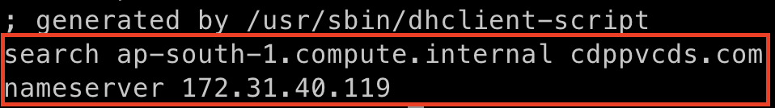
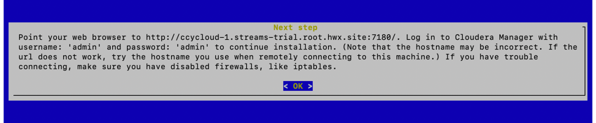

= CDP Private Cloud Setup on AWS Infrastructure
:toc:

This document provides all the required information for Cloudera Partners to setup and install CDP Private Cloud on AWS Infrastructure(*EC2*). In addition to exploring the benefits of CDP Private Cloud with its rich Data Services, this setup can also be used for *ISV/IHV* certification, getting a Hands-on experience, or for any demos with potential customers. 

== Introduction

Cloudera Data Platform is a single platform that has two form factors CDP Public and CDP Private cloud. 

*CDP Public Cloud* is an integrated analytics and data management platform deployed on *cloud services*. It consists of a number of cloud services designed to address specific enterprise data cloud use cases.
This includes Data Hub powered by Cloudera Runtime, self-service experiences (Data Warehouse, Machine Learning, and Data Engineering) running on containers, the administrative layer (Management Console), and SDX services (Data Lake, Data Catalog, Replication Manager, and Workload Manager).

*CDP Private Cloud* is an integrated analytics and data management platform deployed in *private data centers*. It consists of CDP Private Cloud Base and CDP Private Cloud Data Services and offers broad data analytics and artificial intelligence functionality along with secure user access and data governance features. CDP Private Cloud (PvC) data services components run on containerized cluster and thus requires a container orchestration engine to manage all the workloads. CDP PvC offers installation with two orchestration engines. 

* Openshift Container Platform

* Embedded Container Service (Cloudera managed)

In this document, we focus on CDP Private Cloud setup with *ECS*. Let's have a look at the prerequisites before proceeding with the actual setup.

== Prerequisites

*Entitlements*

Your License key must have the PvC DS entitlement. A current key without the entitlement will block access to ECS bits. Please raise a ticket or reach out to the Cloudera POC to get the necessary entitlements.

*AWS*

Administrator access to AWS account. Please verify the resource limits in the region where you wish to deploy the cloud resources. 

== Infrastructure Setup

Below table summarizes the machines used for this POC. This is a minimum requirement, One can increase the number of machines to achieve High Availability and Fault Tolerance. If this cluster is not meant to perform any benchmarking or performance test, one can proceed ahead with this infrastructure.

=== Hardware [[Hardware_Table]]

[frame=all, grid=all]
|===
|AWS Resource | Machine Size | Count | CDP Role | Storage

|EC2|m5.4xlarge|1|FreeIPA server|50 GB EBS Root volume

|EC2|m5.8xlarge|4|CDP Base Cluster|200 GB EBS Root volume

|EC2|m5.4xlarge|6|CDP ECS Cluster|150 GB Root Volume and  2 TB For ECS

|Elastic IP|NA|2|For Data Services & Cloudera Manager|NA
|===

=== Software

Below table summarizes the list of softwares/packages and their use for setting up CDP PvC cluster. 

[frame=all, grid=all]
|===
|Software | Version | Node | Role | Availability 

|Centos              |7.9         |All Machines           |Operating System      |AMI
|IPA Server          |Latest      |IPA Machine            |For Setting up KDC,DNS|Yum Package
|IPA Client          |Latest      |All Machines           |IPA/DNS Communication |Yum Package
|NFS Utility Package |Latest      |All Machine            |NFS Communication     |Yum package
|Cloudera Manager    |7.9.5       |CDP Base               |Management            |Cloudera Repo
|Cloudera Runtime    |7.1.8       |CDP Base and ECS Nodes |Runtime               |Cloudera Repo          
|Cloudera ECS        |1.5.0       |ECS Cluster Nodes      |Data Services         |Cloudera Repo
|OpenJDK             |1.8         |All Machines           |All CDP Hosts         |Cloudera Repo
|===

=== Summary
The below table contains the names assigned to the EC2 instances and to some other required components. Going forward in this document will refer to them by name.

*Note:* The hostnames mentioned here are just for convenience. You may choose to have the hostnames as per your requirements. 

[frame=all, grid=all]
|===
|Name                              |Description 

|pvcbasemaster                     |One Node CDP Private Cloud Base Master
|pvcbaseworker1 to pvcbaseworker3  |CDP Base Cluster Worker Nodes
|pvcipaserver                      |FreeIPA Server
|pvcecsmaster                      |ECS Master Node
|pvcecs1 to pvcecs6                |ECS Worker Nodes
|PVCSG                             |Common Security Group For All EC2.
|PVCBASE.COM                       |Dummy Domain For POC Purpose
|===

Once you have familiarized yourself with all the information mentioned above, you can start with the preliminary work for CDP Base setup. 

== Preliminary Work [[Preliminary_Work]]

Before getting into the actual installation of CDP Private Cloud Base & Data Services we need to prepare our machines and perform some steps to meet the prerequisites. 

=== Create Base AMI

In this step, an AMI will be created which will serve as the base AMI to provision all the EC2 instances that form the CDP PvC cluster. 

==== Step1

* Login to the AWS account and select the Region in which you want to deploy the cluster. 

* Start a t2.micro instance by using the AMI *CentOS 7 (x86_64) - with Updates HVM* and deploy it in the Public Subnet.

* Ensure that the OS version is Centos 7.9. 

* To verify the version, run the below command. It should return CentOS Linux release 7.9.2009 (Core). 
[,shell]
----
    cat /etc/centos-release
----
image::images/centos_ver.png[]

* If the output shows the version as Centos 7.6, then run the below command to update the OS to 7.9. Before updating, switch to root account. 
[,shell]
----
    sudo su - root
    yum update -y
----

* Generate a password protected private key by using the below command and create a password for this private key by entering it when prompted. 
[,shell]
----
    ssh-keygen -t rsa  -f /root/.ssh/id_rsa_new
----

* Add the newly created key into authorized_keys by using below command. 
[,shell]
----
    cat /root/.ssh/id_rsa_new.pub >> /root/.ssh/authorized_keys
----

* Download the *id_rsa_new* key file to your local machine by using sftp. This will be required at the time of installation.

==== Step2

*  Reboot the instance and re-login and change the user to *root*. 

* *Disable SELinux:* Open the file */etc/selinux/config* for editing and update the value as shown below. 
[,shell]
----
    vi /etc/selinux/config
    SELINUX=disabled
----

* *Set swappiness to 1:* Open the file */etc/sysctl.conf* for editing and add the below line.
[,shell]
----
    vi /etc/sysctl.conf
    vm.swappiness=1
----

* *Disable Transparent Huge Pages:* Open the file */etc/rc.d/rc.local* for editing and add the below lines.
[,shell]
----
    vi /etc/rc.d/rc.local
    echo never > /sys/kernel/mm/transparent_hugepage/enabled
    echo never > /sys/kernel/mm/transparent_hugepage/defrag
----

* *Disable IPV6:* Open the file */etc/rc.d/rc.local* for editing and add the below lines. 
[,shell]
----
    vi /etc/rc.d/rc.local
    sysctl -w net.ipv6.conf.all.disable_ipv6=1
    sysctl -w net.ipv6.conf.default.disable_ipv6=1
    sysctl -w net.ipv6.conf.lo.disable_ipv6=0
----

* *Add execute permission:* Run the below command to add execute permission to the file */etc/rc.d/rc.local*. 
[,shell]
----
    chmod +x /etc/rc.d/rc.local
----

* *Install packages:* Install the packages *_ipa-client_*, *_wget_*, *_ntpd_* through *yum* using the below command. 
[,shell]
----     
    yum install -y ipa-client wget ntpd
----

==== Step3 [[AMI_creation]]
 
* *Create AMI:* Open AWS console and create AMI of this machine. Once the AMI is in *"Available"* state, terminate this instance. 

For all the EC2 instances to be created next, this AMI will be used. 

=== Install and Setup of IPA services [[DNS_server_setup]]

In this step a DNS server will be configured and will set up this using an IPA server. In this step we will also configure  other services like KDC, Directory Service on this IPA server. Also, please note that the hostnames used in this installation can be modified as per your requirements. 

==== Step1

* Create an EC2 instance using AMI created at <<AMI_creation>> . Refer to the <<Hardware_Table>> table for machine type , EBS Volume Size, and associated Security Group.

* Once logged into the above created instance, install the following packages through yum using the below command.

[,shell]
----
yum install -y ipa-server bind bind-dyndb-ldap ipa-server-dns firewalld
----

* Set the hostname of this EC2 instance. The hostname should be FQDN. 

[,shell]
----
sudo hostnamectl set-hostname --static ipaserver.cdppvcds.com
----

* Take the private IP of this machine and add an entry in *_/etc/hosts_* file.

[,shell]
----
<PRIVATE_IP_OF_MACHINE> ipaserver.cdppvcds.com
----

* *Reboot the machine and login back.*

==== Step2

* Verify the hostname of the IPA server with the below command. It should return the same FQDN set in the previous step. 

[,shell]
----
cat /etc/hostname
----

* Configure the IPA server by running below command as a root user. 
[,shell]
----
ipa-server-install --setup-dns
----

* Follow the on screen instructions and provide the inputs for the parameters as per the table below.

[frame=all, grid=all]
|===
|Parameter                              |Value 

|Server host name [ipaserver.cdppvcds.com]                |*ipaserver.cdppvcds.com*
|Please confirm the domain name [cdppvcds.com]            |*cdppvcds.com*
|Please provide a realm name [CDPPVCDS.COM]               |*CDPPVCDS.COM*
|Directory Manager password                               |<Password For Directory Manager>
|Password (confirm)                                       |<Confirm Password>
|IPA admin password                                       |<Password For IPA Admin>
|Password (confirm)                                       |<Confirm Password>
|Do you want to configure DNS forwarders? [yes]           |no
|Do you want to search for missing reverse zones? [yes]   |no
|Continue to configure the system with these values? [no] |yes
|===

Please keep the same password for both Directory manager and IPA admin so that there is no confusion in future while using the same. Also, note down the password separately. 

*The setup will take 10-15 Minutes. If everything goes fine then you should get an output similar to the below screenshot.*

image::images/ipa_server_setup.png[]

* _If the installation fails, then run the below command to uninstall and retry with the above command for installation._
[,shell]
----
ipa-server-install --uninstall
----

* Update firewall rule to allow ports using  below command.
[,shell]
----
firewall-cmd --permanent --add-port={80/tcp,443/tcp,389/tcp,636/tcp,88/tcp,464/tcp,53/tcp,88/udp,464/udp,53/udp,123/udp,749/tcp,749/udp}
----

* Verify the setup by generating a ticket for the admin user. Execute *kinit admin* and provide the directory password given during ipa server installation. The command should generate the ticket and should be listed by executing *klist -e*. This command should return the below output.

image:images/klist_verify.png[]

=== Setup Reverse DNS Zone

In this step we will be setting up a reverse DNS zone on the FreeIPA server for reverse lookup and we will also update the network configuration files on the IPA server to use the Name Server created in <<DNS_server_setup>> . 

==== Step1

* Login to IPA Server as root and get the private IP of the server with the below command.  

[,shell]
----
    hostname -i
----

* Open the file */etc/resolv.conf* in edit mode and add the following. 
[,shell]
----
    nameserver <PRIVATE_IP_OF_IPASERVER>
----

Make sure the above is added above any other nameserver entry. The contents of the file must look similar to the below. 

* The above changes are temporary and would get overwritten if the machine is rebooted. In order to keep the nameserver entry persistent, open the file */etc/sysconfig/network* in edit mode and add below entries. 
[,shell]
----
    NETWORKING=yes
    NISDOMAIN=<domain>
    DNS1=<Private_IP_Of_IPA_Server>
    NOZEROCONF=yes
----

The file content must look similar to the below. 

image:/AWS_Infrastructure/images/sysconfig_network.png[]

* Reboot the machine and verify the contents of */etc/resolv.conf* are unchanged and ensure that there is an entry of our nameserver. 

* Run the below command to authenticate as admin through kadmin and enter the directory password. 
[,shell]
----
    kinit admin
----

* Take the CIDR block of the VPC in which the EC2 instances are created and create a reverse DNS zone by executing the below command on the IPA Server machine. 
[,shell]
----
    ipa dnszone-add --name-from-ip=<YOUR_VPC_CIDR>
----
* If your VPC has a CIDR *172.31.0.0/16*, then the command looks as below. 
----
    ipa dnszone-add --name-from-ip=172.31.0.0/16
----

* Once you execute the above command, accept the default value by hitting the enter key. It will create a reverse DNS zone by name 31.172.in-addr.arpa. (with a trailing dot)

image::images/ipa_dns_zone_add.png[]

* Add the entry of this IPA server machine to the reverse DNS zone . We need to add the IPV4 address in reverse order. The first two octets are already added in the reverse zone above. Now we need to create a record for this machine inside that zone . In the command below you need to add the record by providing the last two octets of your machine's private IPV4 in reverse order. Include the trailing dot after the machine name.
[,shell]
----
    ipa dnsrecord-add <2nd>.<1st>.in-addr.arpa. <4th>.<3rd> --ptr-rec <ipaserver FQDN>.
    ipa dnsrecord-add 31.172.in-addr.arpa. 119.40 --ptr-rec ipaserver.cdppvcds.com.
----

*Please note that there is a trailing dot after the IPASERVER FQDN in the above command.*

image::images/ipa_dnsrecord_add.png[]

* The above command should succeed. In order to validate it, we need to verify the forward and reverse lookup on this machine. 

** Verify the Forward lookup by running the below command. This command should return the IPV4 of the machine in the *Answer* Section. 

[,shell]
----
     dig <FQDN of the IPASERVER> A
Ex:- dig ipaserver.cdppvcds.com A  
----

Sample output shown below. 

** Verify the Reverse lookup by running the below command. This command should return the hostname of the machine in the *Answer* Section. 
[,shell]
----
     dig -x <Private_IP_of_IPASERVER>
     dig -x 172.31.40.119
----

Sample output shown below. 

=== Add all the machines to the DNS server [[Cluster_Hosts]]

The tasks in this step need to be performed on all Machines except the IPA Server machine. 

* Provision the EC2 instances for both Base and ECS clusters. Refer to the <<Hardware_Table>> table for machine specification, EBS Volume, and Security Group details. 

* Set the static hostname on each machine by using the command below. 
[,shell]
----
    sudo hostnamectl set-hostname --static <Hostname_with_Your_Domain>
----

* Either copy the */etc/resolv.conf* and */etc/sysconfig/network* file from the IPA server machine to all the machines or update manually on each machine to have the same configuration on all the hosts. 

* On each machine run the below command to set up the IPA client. 
[,shell]
----
    ipa-client-install --force-ntpd
----

* Enter the values for these parameters as below. After entering these values, it should return the message as "The ipa-client-install command was successful". 
[frame=all, grid=all]
|===
|Parameter                                                     |Value 

|Continue to configure the system with these values? [no]: yes |yes
|User authorized to enroll computers:                          |admin
|Password for admin@<Your_Domain>                              |<Password created earlier>

|===

* Generate the kerberos ticket for admin by running the below command. 
[,shell]
----
    kinit admin
----

* Once the ipa-client configuration is successful we need to create a record in the Reverse DNS zone as well for each machine. Use the below command as reference and make changes as per your configuration/machine’s private IP and Hostname. 
[,shell]
----
Private IP of the EC2 instance: 172.31.0.234
Hostname of the EC2 instance:   cdpbase.cdppvcds.com
----

Generate the command as shown below and run the same on all the FreeIPA agents, that includes all the nodes of Base and ECS cluster. 

[,shell]
----
ipa dnsrecord-add <2nd>.<1st>.in-addr.arpa. <4th>.<3rd> --ptr-rec <IPA_Client FQDN>.

ipa dnsrecord-add 31.172.in-addr.arpa. 234.0 --ptr-rec cdpbase.cdppvcds.com.
----

image::images/ipa_dns_record_ipa_agent.png[]

* The record for the machine should be created in the Reverse DNS zone. 

* Verify the Forward and Reverse Lookup from each machine as mentioned previously. 

** Verify the Forward lookup by running the below command. This command should return the IPV4 of the machine in the *Answer* Section. 

[,shell]
----
     dig <FQDN of the IPAAGENT> A
Ex:- dig cdpbase.cdppvcds.com A
----

Sample output shown below. 

** Verify the Reverse lookup by running the below command. This command should return the hostname of the machine in the *Answer* Section. 
[,shell]
----
     dig -x <Private_IP_of_IPAAGENT>
     dig -x 172.31.0.234
----

Sample output shown below. 

=== Create Local mirror for ECS bits

This is an optional step however if performed, it can save a good amount of time during the ECS installation. The total size of ECS bits/images is nearly *85G* and the installer will take time to download these during the actual installation. 

* Identify any machine from the EC2 instances created before and install httpd by using the below command.  
[,shell]
----
    yum install -y httpd
----

* Start the httpd service and enable it to run even after reboot with the commands below. 
[,shell]
----
    systemctl start httpd
    systemctl enable httpd
----

* Create a directory to save the ECS images. 
[,shell]
----
    mkdir -p /var/www/html/cdp-pvc-ds
----

* Navigate to the above created directory and create a new shell script file with the below content. 
[,shell]
----
    vi download_ecs.sh
----

* Copy the below script in the newly created file *download_ecs.sh*. 

[,shell]
----
echo "Starting the ECS bits download"

wget -l 0 --recursive r-no-parent -e robots=off -nH --cut-dirs=2 --reject="index.html*" -t 10 https://<CDP_LICENSE_USERNAME>:<CDP_LICENSE_PASSWORD>@archive.cloudera.com/p/cdp-pvc-ds/latest/ -P /var/www/html/cdp-pvc-ds/latest

RETURN_VAL=$?

echo "--------------------------------------------------------"

if [[ "${RETURN_VAL}" == 0 ]]; then
    echo "Successfully downloaded."
else
    echo "Download not successful."
fi
----

* Run this script in nohup to keep the job running in background. 
[,shell]
----
    nohup sh download_ecs.sh > download_ecs.log &
----

* This will take nearly 5-6 hours based on the network speed. Keep checking the logs of download_ecs.log and if you see the *Successfully downloaded* message, then it means all the images got downloaded successfully. To check the logs, you can use any of the below commands.  
,shell]
----
    tail -f download_ecs.log
    cat download_ecs.log
----

* Once the images got successfully downloaded, please proceed to the CDP Private Cloud Base setup.

== Private Cloud Base Setup
This section outlines the steps needed to set up a 4 nodes Private Cloud Base . Below are the prerequisites which base cluster should have before installing/configuring Data Services.

=== Download the Installer & Cloudera Repository file
* *Step 1:* Login the pvcbasemaster EC2 instance and switch to 'root' user. 
* *Step 2:* Navigate to */etc/yum.repos.d/* directory
[,shell]
----
   cd /etc/yum.repos.d/
----

* *Step 3:* Execute below command after replacing your *Cloudera Paywall Credentials*.
[,shell]
----
wget  https://<user_name>:<password>@archive.cloudera.com/p/cm7/7.9.5/redhat7/yum/cloudera-manager.repo
----
* *Step 4:* Navigate to */tmp/* directory
[,shell]
----
cd /tmp/
----

* *Step 5:* Download the *‘cloudera-manager-installer.bin’* file by using below command after replacing your *Cloudera Paywall Credentials*
[,shell]
----
wget https://<user_name>:<password>@archive.cloudera.com/p/cm7/7.9.5/cloudera-manager-installer.bin
----

* *Step 6:* Add the Executable permission to above downloaded file.
[,shell]
----
chmod u+x cloudera-manager-installer.bin
----
=== Install *Cloudera Manager* with *Embedded Database*.

* *Step 1:* Navigate to */tmp* directory.
[,shell]
----
cd /tmp/
----
* *Step 2:* Execute the bin file using below command to install.
[,shell]
----
./cloudera-manager-installer.bin
----

*1:* The *Cloudera Manager Read Me* page appears.

Click *Next*

*2:* The *Cloudera Standard License* page appears.

Click *Next* to accept the license agreement

*3:* The installer starts and does the following:

   * *A:* Installs Oracle JDK:
   

         
   * *B:* Installs the Cloudera Manager Server. 
   
image::images/cdp-quick-start-deployment-streams-install-cm-server.png[]
         
   * *C:* Installs the embedded PostgreSQL packages and starts the database and Cloudera Manager Server. 
   
image::images/cdp-quick-start-deployment-streams-install-db.png[]

[,shell]
----
NOTE:
If the installation is interrupted, run the following command on the Cloudera Manager Server host before you retry the installation:
----
----
sudo /usr/share/cmf/uninstall-cloudera-manager.sh
----
----
The log files for the installer are stored in /var/log/cloudera-manager-installer/.
----
*4:* Exit the installer:

   * *A:* When the installation completes, the complete URL for the Cloudera Manager Admin Console displays, including the default port number: 7180.
    
           Make a note of this URL or take a screen capture as you will need it for the next task.
           

   * *B:* Click *Ok*
   
          The success message appears
   
   * *C:* Click OK to exit the installer.
   
   
   
== Private Cloud Data Services Setup

=== Step1: Prepare ECS Nodes

* Start the EC2 instances designated for the ECS cluster created in the step <<Cluster_Hosts>> in the <<Preliminary_Work>> section. Refer to the <<Hardware_Table>> table for machine type , EBS Volume Size, and associated Security Group. 

* On each of the ECS hosts, create three partitions of attached EBS volume (non-root) and mount those as below. 

image::/AWS_Infrastructure/images/lsblk_ecs.png[]

          
---
*Authors*

Puneet Joshi puneetjoshi@cloudera.com

Pannag Katti pkatti@cloudera.com

version-1.0, Feb 22, 2023
